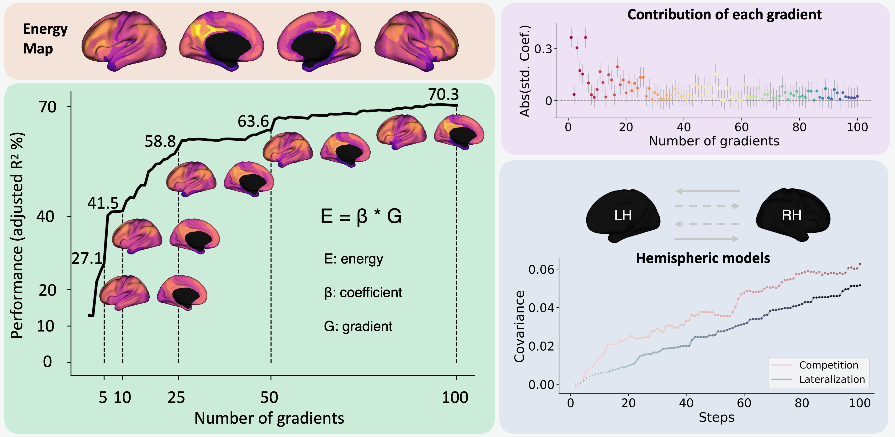

# Cortical energy cost of hemispheric functional organization

**Bin Wan, Valentin Riedl,  Gabriel Castrillon, Matthias Kirschner, Sofie L. Valk**. 

Preprint: https://www.biorxiv.org/content/10.1101/2024.09.26.615152v1

 
S
## Source data
Raw data can be downloaded from OpenNeuro (https://openneuro.org/datasets/ds004513/versions/1.0.4)

Group-level and individual data have been processed by the scripts below. See directory "./reseults"

- ./reseults/func -> functional connectivity matrix

- ./reseults/glucose -> glucose metabolism data

- ./reseults/grad -> functional connectivity gradients using diffusion map embedding

Then above results can be reproduced.
- ./reseults/models -> gradient-energy models, null models, and asymmetry models


## Step 1: transform indiviudal glucose metabolism map from volume to surface

```
bash ./bash/CMRglu3mm_2_surface.sh 
```

## Step 2: functional connectome (FC) gradients at group level
**Outputs also contain individual FC matrix but not gradients**

```
# parcellate CMRglc map into glasser360 and save fsLR-5k individuall  
python ./python/py01_glucose_mapping_fsLR.py

# calculate the FC gradients for hemispheres at fsLR-5k group level
python ./python/py02_fc_group_grad_vertex.py 

# calculate the FC gradients for hemispheres at glasser group level
python ./python/py02_fc_group_grad_parcel.py fsLR

# Prepare surrogate maps for gradients or CMRglc
python ./python/py03_null.py

# When comparing asymmetry alignment between left and right
python ./python/py04_supplements_alignLH2RH.py

# visualization for vertex level
python ./python/py04_supplements_vertex.py

```

## Step 3: Modeling between CMRglc and gradient maps
ipython notebooks to visualize the results

`./python/vis01_fitting_group_level_mmp.ipynb ` visulizes all the group-level result figures. 

`./python/vis02_null.ipynb ` visulizes null model figures. 

`./python/vis03_fitting_invidual_level_mmp.ipynb ` visulizes all the invidual-level result figures.


## Main dependencies based on Python 3.8
- BrainSpace
- BrainSMASH
- Scikit-learn
- Statsmodel


## Fundings 

- BW: International Max Planck Research School on Neuroscience of Communication: Function, Structure, and Plasticity (IMPRS NeuroCom). 

- VR: the European Research Council (ERC) under the European Union’s Horizon 2020 research and innovation program (ERC Starting Grant, ID 759659). 

- SLV: the Otto Hahn Award at the Max Planck Society and Helmholtz International BigBrain Analytics and Learning Laboratory (HIBALL), supported by the Helmholtz Association’s Initiative and Networking Fund and the Healthy Brains, Healthy Lives initiative at McGill University